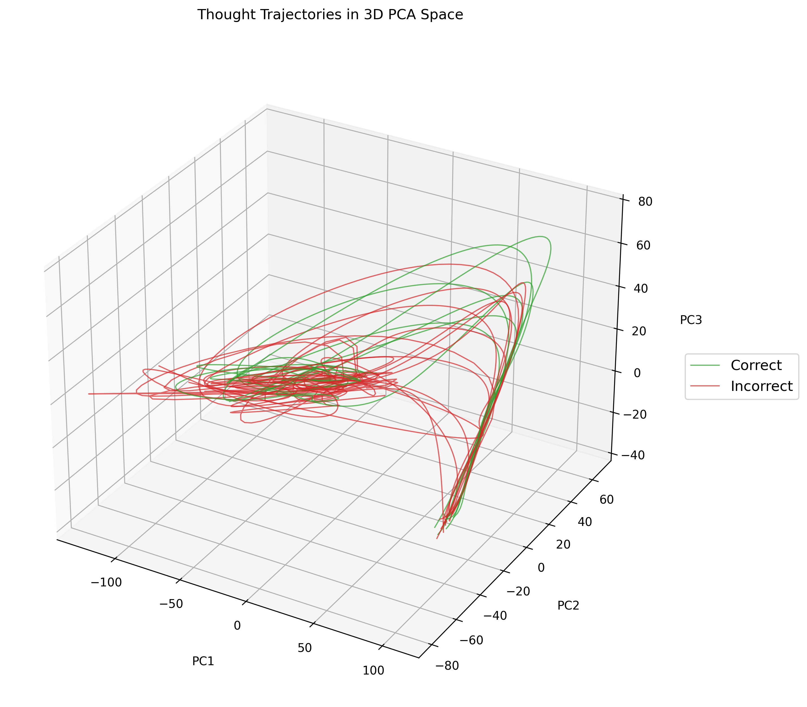

# Optimizing Latent Reasoning in LLMs with *ThoughtMiner*


**Master Thesis**


Author: *Aleksandrs Baskakovs, Aarhus University, Cognitive Science MSc*

Supervisor: *Nicolas Legrand*

Date: *June 2nd, 2025*

---

## Overview

**ThoughtMiner** is a toolkit for extracting, analyzing, and modeling latent reasoning in Large Language Models (LLMs) on any kind of reasoning problems.

It enables you to visualize trajectories through the hidden state space, analyze patterns of reasoning, train custom reward models for reasoning optimization and use the trained reward models to post-train LLMs with *Unsloth*.

The core of the project is the `ThoughtMiner` class (see `thoughtminers/miners.py`), which segments completions into discrete reasoning steps and extracts hidden states for the said steps for further modeling.

Two notebooks are provided to demonstrate the end-to-end process:
- `notebooks/reward_model_training.ipynb`: An end-to-end example of extracting trajectories, and training a reward model to distinguish 'good' reasoning from 'bad' reasoning.
- `notebooks/post_training.ipynb`: A notebook that shows how to use the trained reward model to post-train an LLM with Unsloth. Optimized for use in Google Colab (requires a GPU).
---

## Visualising Reasoning

Consider the following model-generated reasoning completion for a mathematical problem:

<pre>
```
Step 1: Let’s denote the unknown as x.
Step 2: We know that x + 3 = 7.
Step 3: Subtract 3 from both sides to get x = 4.
Step 4: Therefore, the answer is 4.
```
</pre>

By segmenting a completion into discrete reasoning steps, we can extract the corresponding hidden state vector for each step. Each of these vectors can be interpreted as a point in a high-dimensional representation space, effectively mapping out the model’s evolving internal state as it proceeds through its reasoning process. Sequentially connecting these points yields a trajectory—a “walk” through the model’s latent reasoning space—which reflects how the model incrementally constructs a solution.

To facilitate interpretation and visualization, we employ dimensionality reduction techniques such as Principal Component Analysis (PCA) to project these high-dimensional trajectories into three dimensions. The figure below presents an example of such a projection. While higher-dimensional representations are typically used in downstream modeling to retain greater fidelity of the original signal, 3D visualizations are a useful tool for gaining qualitative insight into the structure and dynamics of the model’s reasoning pathways.



---

## Repository Structure

```
thoughtminers/
│
├── thoughtminers/
│   ├── __init__.py               # Package init; exposes ThoughtMiner class
│   └── miners.py                 # The ThoughtMiner class for trajectory extraction
│
├── notebooks/
│   ├── main_analysis.ipynb       # End-to-end reward model training notebook
│   └── post_training.ipynb       # Post-training an LLM with Unsloth notebook
│
├── data/
│   └── README.md                 # Description of data folder
│
├── models/
│   └── README.md                 # Description of models folder
│
├── plots/
│   └── pca_trajectories_3d.png   # Example plot
│
├── pyproject.toml                # Dependency and metadata management
├── README.md                     # Project overview and instructions
└── .gitignore                    # Exclude venv, checkpoints, etc.
```

## Getting Started

### Prerequisites

- Python 3.9 or higher (Python 3.13+ recommended)
- [uv](https://github.com/astral-sh/uv) (dependency and environment management tool)
    ```bash
    pip install uv
    ```

---

### Setup Instructions

1. **Clone the repository:**
    ```bash
    git clone https://github.com/sashapustota/thoughtminers.git
    cd thoughtminers
    ```

2. **Create a virtual environment:**
    ```bash
    uv venv
    ```

3. **Install dependencies and package in editable mode:**
    ```bash
    uv pip install -e .
    ```

4. **(Optional) Register Jupyter kernel for notebooks:**
    ```bash
    uv run ipython kernel install --user --env VIRTUAL_ENV=$(pwd)/.venv --name=thoughtminers
    ```

5. **Launch Jupyter and open the main notebook:**
    ```bash
    uv run jupyter notebook
    ```
    - Select the `thoughtminers` kernel when running the notebook.

---

## License

Apache-2.0 license. See [LICENSE](LICENSE) for details.

---

## Acknowledgements

Developed by Aleksandrs Baskakovs, under supervision of Nicolas Legrand at Aarhus University, Cognitive Science MSc for the master (product) thesis titled "Optimizing Latent Reasoning in LLMs with **ThoughtMiner**".

---